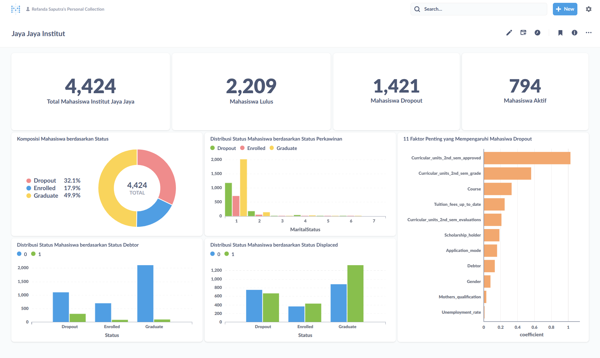

# Proyek Akhir: Menyelesaikan Permasalahan Perusahaan Edutech

## Business Understanding

Jaya Jaya Institut merupakan salah satu instusi pendidikan perguruan yang telah berdiri sejak tahun 2000. Hingga saat
ini ia telah mencetak banyak lulusan dengan reputasi yang sangat baik. Akan tetapi, terdapat banyak juga mahasiswa yang
tidak menyelesaikan pendidikannya alias dropout.

Jumlah dropout yang tinggi ini tentunya menjadi salah satu masalah yang besar untuk sebuah institusi pendidikan. Oleh
karena itu, Jaya Jaya Institut ingin mendeteksi secepat mungkin mahasiswa yang mungkin akan melakukan drop sehingga
dapat diberi bimbingan khusus.

Jaya Jaya Institut membutuhkan solusi untuk permasalahan mereka dan menyediakan dataset yang berisi performa mahasiswa,
Mereka membutuhkan dashboard yang dapat memudahkan dalam memahami data dan memonitor performa mahasiswa.

### Permasalahan Bisnis

Terdapat beberapa permasalahan bisnis yang terjadi pada institusi Jaya Jaya berdasarkan latar belakang perusahan di
antaranya adalah:

- Faktor apa saja yang dapat mempengaruhi seorang mahasiswa memutuskan untuk Dropout dari Jaya Jaya Institut?
- Bagaimana cara mengidentifikasi seorang mahasiswa apakah dia berpotensi akan Dropout dari Jaya Jaya Institut dengan
  cepat dan
  efektif?
- Bagaimana membangun business dashboard yang dapat membantu Jaya Jaya Institut untuk melakukan montoring faktor yang
  mempengaruhi tingginya Dropout pada mahasiswa?

### Cakupan Proyek

Untuk menyelesaikan permasalahan di Jaya Jaya Institut mengenai banyaknya mahasiwa yang Dropout adalah dengan membuat
model machine learning yang mampu memprediksi apakah mahasiswa tersebut berpotensi Dropout dari institusi dengan melihat
faktor-faktor yang ada.

Untuk melihat faktor-faktor yang paling mempengaruhi tingginya Dropout oleh mahasiswa dapat melakukan Exploratory Data
Analysis
untuk memperolah gambaran terkait dataset yang digunakan. Selain itu, juga menerapakan metode Wrapper dengan teknik
RFE (Recursive Feature Elimination) untuk mendapatkan
faktor-faktor yang paling berpengaruh. Jadi, model yang dibuat dapat memprediksi dengan baik dan diharapkan dapat
mengatasi permasalahan institusi.

Berdasarkan cakupan proyek ini, dibutuhkan beberapa resource dan tool, yaitu

- Dataset yang berisi detail performa mahasiswa
- Bahasa pemrograman python dan library seperti pandas, scikit-learn, matplotlib, streamlit dan seaborn untuk membangun
  model Machine
  Learning

### Persiapan

Sumber data: Pada proyek ini digunakan dataset dari tautan
berikut: [Jaya Jaya Institut](https://github.com/dicodingacademy/dicoding_dataset/blob/main/students_performance/data.csv)

Setup environment:

#### 1. Prasyarat (Prerequisites)

Pastikan perangkat Anda telah memenuhi prasyarat berikut sebelum memulai:

- **Python**: Versi 3.12 atau yang lebih baru.
- **Docker**: Terinstal dan berjalan di sistem Anda. Docker diperlukan untuk menjalankan dashboard Metabase.

---

#### 2. Instalasi Lingkungan Kerja

Ikuti langkah-langkah berikut untuk menyiapkan lingkungan dan menginstal semua library yang dibutuhkan.

**Clone Repositori**

Buka terminal atau command prompt, lalu clone repositori ini ke dalam direktori lokal Anda.

```bash
git clone [URL_REPOSITORY_ANDA]
cd [NAMA_FOLDER_PROYEK]
```

**Instal Library**

Proyek ini menggunakan beberapa library Python yang tercantum dalam berkas `requirements.txt`. Jalankan perintah berikut
untuk menginstalnya:

```bash
pip install -r requirements.txt
```

Perintah ini akan secara otomatis menginstal `scikit-learn`, `joblib`, `pandas`, `numpy`, `matplotlib`, dan `seaborn`
dengan versi yang sesuai.

---

#### 3. Menjalankan Analisis & Pemodelan

Berkas `notebook.ipynb` berisi seluruh proses analisis, mulai dari eksplorasi data (EDA), pra-pemrosesan, pemodelan,
hingga evaluasi.

Anda dapat membuka dan menjalankan berkas ini menggunakan salah satu platform berikut:

- **Google Colab**: Unggah berkas `notebook.ipynb` ke Google Colab dan jalankan sel-selnya secara berurutan.
- **Kaggle Notebook**: Buat notebook baru di Kaggle dan unggah berkas `notebook.ipynb`.
- **Lingkungan Lokal (PyCharm, VS Code)**: Buka folder proyek di IDE Anda dan jalankan notebook melalui ekstensi Jupyter
  yang terintegrasi.

---

#### 4. Menjalankan Dashboard Metabase

Dashboard interaktif untuk proyek ini dibuat menggunakan **Metabase** dan dijalankan melalui **Docker**. Ikuti
langkah-langkah berikut untuk mengaksesnya:

**Tarik (Pull) Image Metabase dari Docker Hub**

Buka terminal Anda dan jalankan perintah berikut untuk mengunduh image Metabase versi terbaru.

```bash
docker pull metabase/metabase:latest
```

**Jalankan Container Metabase**

Setelah proses unduh selesai, jalankan container menggunakan perintah di bawah ini. Perintah ini akan menjalankan
Metabase di latar belakang dan memetakannya ke port 3000 di komputer Anda.

```bash
docker run -d -p 3000:3000 --name metabase metabase/metabase:latest
```

**Akses Metabase di Browser**

Buka browser favorit Anda dan kunjungi alamat berikut:

```
http://localhost:3000
```

**Lakukan Setup Awal dan Login**

Saat pertama kali mengakses, Anda akan disambut oleh halaman setup Metabase.

Ikuti prosesnya dan ketika diminta untuk membuat akun admin, isikan kredensial berikut:

- **Email**: `root@mail.com`
- **Password**: `root123`

Selesaikan langkah-langkah setup lainnya. Setelah itu, Anda akan diarahkan ke halaman utama Metabase.

**Hubungkan ke Database dan Akses Dashboard**

Setelah berhasil login:

1. Hubungkan Metabase ke sumber data (misalnya PostgreSQL atau MySQL) tempat data proyek ini disimpan.
2. Setelah koneksi berhasil, Anda dapat menemukan dan mengakses dashboard yang telah dibuat untuk proyek ini.

## Business Dashboard

Berikut ini adalah business dashboard yang telah dibuat pada proyek ini untuk membantu Jaya Jaya Instiut melakukan
monitoring faktor yang mempengaruhi tingkat Dropout mahasiswa.



Dashboard ini menyajikan gambaran umum kondisi dan status mahasiswa di Jaya Jaya Institut, mulai dari
data ringkasan hingga analisis faktor-faktor yang mempengaruhi mahasiswa dropout.

**Tujuan Dashboard:**

Tujuan utamanya adalah untuk memberikan wawasan kepada Jaya Jaya Institut mengenai:

- Distribusi status mahasiswa secara keseluruhan (Lulus, Dropout, Aktif).
- Karakteristik mahasiswa berdasarkan berbagai atribut (status perkawinan, hutang, dll.).
- Faktor-faktor paling signifikan yang berkontribusi terhadap tingkat dropout mahasiswa

**Poin-Poin Kunci dari Data yang Ditampilkan:**

1. Gambaran Umum:

Dari total 4.424 mahasiswa dalam dataset, hampir setengahnya (49.9% atau 2.209 mahasiswa) berhasil Lulus.
Namun, angka Dropout cukup signifikan, yaitu 32.1% (1.421 mahasiswa). Ini adalah metrik krusial yang perlu menjadi
perhatian utama.
Sisanya, 17.9% (794 mahasiswa), masih berstatus Aktif (Enrolled).

2. Distribusi Berdasarkan Atribut:

- Status Debtor (Hutang): Secara visual, proporsi mahasiswa yang memiliki hutang (Debtor = 1) tampak lebih tinggi pada
  kelompok Dropout dibandingkan pada kelompok Lulus. Ini mengindikasikan adanya korelasi antara kesulitan finansial
  dengan
  kecenderungan dropout.
- Status Perkawinan: Mayoritas mutlak mahasiswa di semua status adalah lajang (MaritalStatus = 1), sehingga atribut ini
  kurang memberikan pembeda yang signifikan tanpa pengelompokan lebih lanjut.

3. Faktor Paling Berpengaruh Terhadap Dropout (Insight Paling Penting):

- Grafik "11 Faktor Penting" adalah bagian paling bernilai dari dashboard ini karena menunjukkan hasil dari model
  prediktif.
- Faktor Akademik adalah yang paling dominan:
    - Jumlah SKS yang Lulus di Semester 2 (Curricular_units_2nd_sem_approved) menjadi prediktor terkuat. Artinya,
      mahasiswa
      yang kesulitan lulus mata kuliah di semester kedua sangat berisiko dropout.
    - Nilai Rata-rata di Semester 2 (Curricular_units_2nd_sem_grade) juga memiliki pengaruh sangat besar.
      Faktor Non-Akademik yang signifikan berikutnya adalah Jurusan (Course) dan status pembayaran Biaya Kuliah (
      Tuition_fees_up_to_date).

## Menjalankan Sistem Machine Learning

Aplikasi Streamlit digunakan untuk menampilkan antarmuka pengguna dari hasil analisis. Terdapat dua cara menjalankan
aplikasi ini:

**Menjalankan Secara Lokal**

Pastikan Anda berada di direktori yang sama dengan berkas `app.py`, lalu jalankan perintah berikut:

```bash
streamlit run app.py
```

Setelah itu, aplikasi akan terbuka secara otomatis di browser melalui alamat default `http://localhost:8501`.

**Deploy ke Streamlit Cloud**

Untuk membagikan aplikasi secara online, Anda dapat menggunakan **Streamlit Cloud**. Berikut langkah singkatnya:

1. Pastikan proyek Anda telah diunggah ke GitHub.
2. Buka [https://streamlit.io/cloud](https://streamlit.io/cloud) dan login menggunakan akun GitHub Anda.
3. Klik **"New app"**, lalu pilih repositori, branch, dan isi nama file utama (`app.py`).
4. Klik **"Deploy"**, dan tunggu hingga proses selesai.

Aplikasi yang telah berhasil dideploy dapat diakses melalui URL berikut:  
[Sistem Prediksi Status Mahasiswa | Prototype ](https://data-science-educational-institution-6snqrfcedseityjgncteaj.streamlit.app/)

## Conclusion

Untuk mengatasi tingginya angka dropout di Jaya Jaya Institut, proyek ini berhasil mengembangkan sebuah solusi
komprehensif yang terdiri dari model prediksi berbasis Random Forest untuk mengidentifikasi mahasiswa berisiko secara
dini. Melalui analisis data dan seleksi fitur menggunakan RFE, ditemukan bahwa faktor prediktif terkuat adalah performa
akademik di semester kedua (jumlah SKS dan nilai), serta status pembayaran biaya kuliah. Wawasan ini kemudian
divisualisasikan dalam sebuah dashboard interaktif yang dibangun menggunakan Metabase untuk memudahkan pemantauan oleh
pihak institut, dan model tersebut juga diimplementasikan dalam aplikasi web praktis dengan Streamlit, sehingga
menyediakan sistem lengkap untuk melakukan intervensi dan memberikan bimbingan khusus kepada mahasiswa yang
teridentifikasi berpotensi dropout.

### Rekomendasi Action Items

Berikut ini beberapa rekomendasi action items yang dapat dilakukan Institusi Jaya Jaya untuk menangani permasalahan
mahasiswa yang Dropout.

- Faktor terkuat yang mempengaruhi dropout adalah performa akademik di semester kedua. Jaya Jaya Institut dan
  memperhatikan mahasiswa yang
  menunjukkan penurunan performa signifikan dan harus segera dipanggil untuk sesi konseling wajib guna mengidentifikasi
  akar
  masalah (akademik, finansial, atau pribadi).
- Menawarkan bantuan seperti skema cicilan, informasi beasiswa, atau konseling keuangan terakit dengan faktor
  Tuition_fees_up_to_date. 